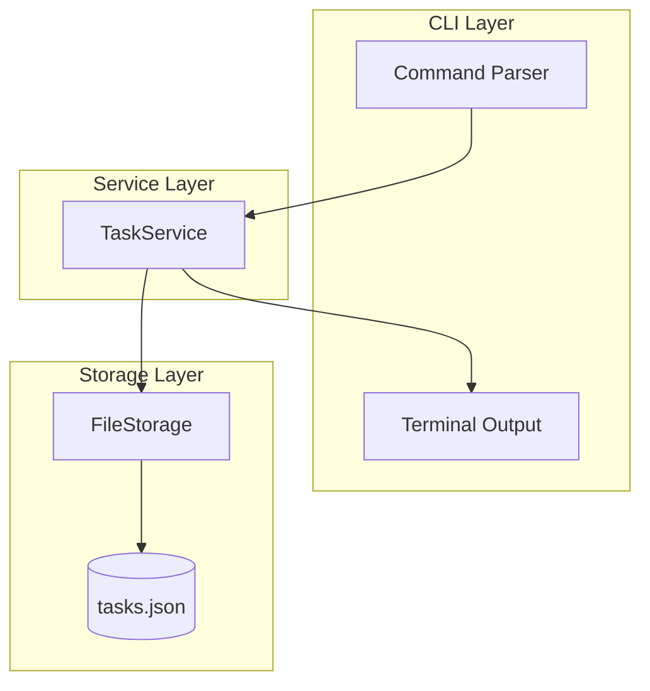
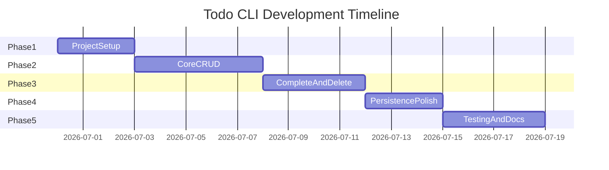

# To-Do List CLI — Architecture

## 1. Overview and Goals

The To-Do List CLI is a terminal-based application that helps users manage their tasks efficiently. Users interact through simple commands to add, view, complete, and remove tasks — all without leaving the command line.

### Purpose

- Provide a fast, distraction-free way to capture and track tasks
- Persist tasks locally so data survives between sessions
- Keep the codebase small, testable, and easy to extend

### Scope (v1)

- Single-user, offline-first application
- No backend server or network dependency
- Local file-based storage on the user's machine

### Non-Goals (v1)

- Cloud sync or remote backup
- Multi-user authentication or accounts
- Web or desktop GUI (see [Future Enhancements](#10-future-enhancements))

---

## 2. Feature Requirements

Each user-facing feature maps to a CLI command and a service-layer operation.

| Feature | CLI Command | Behavior |
|---------|-------------|----------|
| Add new task | `todo add "<title>"` | Creates a task with a unique ID, timestamps, and `completed: false` |
| View tasks | `todo list` | Lists tasks with optional `--all`, `--active`, or `--done` filters |
| Mark completed | `todo done <id>` | Marks the task as completed and updates `updatedAt` |
| Mark active again | `todo undo <id>` | Reverts a completed task to active (Phase 3) |
| Delete task | `todo delete <id>` | Removes a single task by ID |
| Clear all tasks | `todo clear` | Removes all tasks; prompts for confirmation unless `--force` is passed |
| Local persistent storage | automatic | Every mutation writes to disk immediately after the change |

### v1 Feature Checklist

- [ ] Add new task
- [ ] View added tasks
- [ ] Mark task as completed
- [ ] Delete task and clear all tasks
- [ ] Store tasks locally
- [ ] Persistent storage across sessions

---

## 3. High-Level Architecture

The app uses a **layered architecture** so the CLI stays thin and business logic remains testable in isolation.



### Layer Responsibilities

| Layer | Location | Responsibility |
|-------|----------|----------------|
| **CLI Layer** | `src/cli/` | Parse arguments, format terminal output, handle user prompts (e.g. clear confirmation) |
| **Service Layer** | `src/services/` | Business rules: validation, ID generation, CRUD operations |
| **Storage Layer** | `src/storage/` | Read/write JSON file, handle missing or corrupt file recovery |

### Data Flow Example: Adding a Task

1. User runs `todo add "Buy groceries"`
2. CLI Layer parses the command and passes the title to `TaskService.add()`
3. `TaskService` validates the title, creates a `Task` object, and appends it to the in-memory list
4. `FileStorage.saveTasks()` writes the updated list to `data/tasks.json`
5. CLI Layer prints a success message with the new task ID

---

## 4. Proposed Folder Structure

```
to-do-list-cli/
├── ARCHITECTURE.md
├── README.md
├── package.json
├── bin/
│   └── todo.js              # CLI entry point (#!/usr/bin/env node)
├── src/
│   ├── cli/
│   │   ├── index.js         # registers commands
│   │   └── formatters.js    # table/list output for terminal
│   ├── services/
│   │   └── taskService.js   # add, list, complete, delete, clear
│   ├── storage/
│   │   └── fileStorage.js   # load/save tasks.json
│   ├── models/
│   │   └── task.js          # Task shape + factory helpers
│   └── utils/
│       └── id.js            # generate unique task IDs
├── data/
│   └── tasks.json           # default local store (gitignored)
└── tests/
    └── taskService.test.js  # unit tests (Phase 5)
```

> **Note:** The existing Vite + React starter files are unused boilerplate. They will be removed or archived during Phase 1 when scaffolding the CLI.

---

## 5. Data Model

Tasks are stored as a JSON array inside a wrapper object.

```json
{
  "tasks": [
    {
      "id": "a1b2c3",
      "title": "Buy groceries",
      "completed": false,
      "createdAt": "2026-06-29T10:00:00.000Z",
      "updatedAt": "2026-06-29T10:00:00.000Z"
    }
  ]
}
```

### Field Rules

| Field | Type | Rules |
|-------|------|-------|
| `id` | string | Short unique identifier (nanoid or `crypto.randomUUID` slice) |
| `title` | string | Required, trimmed, maximum 200 characters |
| `completed` | boolean | Default `false` |
| `createdAt` | string | ISO 8601 timestamp, set once on creation |
| `updatedAt` | string | ISO 8601 timestamp, updated on every mutation |

### Validation Rules

- Empty or whitespace-only titles are rejected
- Duplicate titles are allowed (each task has a unique ID)
- Special characters in titles are permitted

---

## 6. Persistence Strategy

### Storage Location

- **Default:** `data/tasks.json` in the project root
- **Override:** set the `TODO_DATA_PATH` environment variable to use a custom file path

### Write Policy

- Synchronous write after every mutation (add, complete, delete, clear)
- Simple and reliable for a single-user CLI with no concurrency concerns

### Startup Behavior

| Condition | Action |
|-----------|--------|
| File missing | Create `data/` directory and initialize `{ "tasks": [] }` |
| File exists and valid | Load tasks into memory |
| File corrupt or unreadable | Log error, backup as `tasks.json.bak`, start with empty list |

### Git Configuration

Add the following to `.gitignore`:

```
data/tasks.json
data/tasks.json.bak
```

User task data should never be committed to version control.

---

## 7. Technology Stack

| Concern | Choice | Rationale |
|---------|--------|-----------|
| Runtime | Node.js 20+ | Native ESM, built-in `fs` APIs, cross-platform |
| CLI framework | `commander` | Industry standard, minimal boilerplate |
| IDs | `nanoid` or Node `crypto` | Short, collision-resistant identifiers |
| Terminal styling | `chalk` (optional) | Improved readability for list output |
| Testing | Node built-in `test` runner | No extra test framework needed for v1 |
| Language | JavaScript (ESM) | Matches existing `package.json` `"type": "module"` |

---

## 8. CLI Command Reference

```
todo add <title>                    Add a new task
todo list [--all|--active|--done]   List tasks (default: active only)
todo done <id>                      Mark task as completed
todo undo <id>                      Mark task as active again
todo delete <id>                    Delete a task by ID
todo clear [--force]                Delete all tasks
todo help                           Show usage information
```

### Command Details

#### `todo add <title>`

Creates a new task and persists it immediately.

```bash
todo add "Buy groceries"
# → Task added: [a1b2c3] Buy groceries
```

#### `todo list [--all|--active|--done]`

Displays tasks in a formatted table.

```bash
todo list
# → 1. [ ] Buy groceries          (a1b2c3)

todo list --done
# → (shows completed tasks only)
```

Default filter is `--active` (incomplete tasks only).

#### `todo done <id>`

Marks the specified task as completed.

```bash
todo done a1b2c3
# → Task marked as done: Buy groceries
```

#### `todo undo <id>`

Reverts a completed task back to active.

```bash
todo undo a1b2c3
# → Task marked as active: Buy groceries
```

#### `todo delete <id>`

Permanently removes a single task.

```bash
todo delete a1b2c3
# → Task deleted: Buy groceries
```

#### `todo clear [--force]`

Removes all tasks. Without `--force`, prompts for confirmation.

```bash
todo clear
# → Are you sure you want to delete all tasks? (y/N)

todo clear --force
# → All tasks cleared.
```

---

## 9. Error Handling Conventions

All errors print a human-readable message to `stderr` and exit with code `1`.

| Scenario | Exit Code | Message Example |
|----------|-----------|-----------------|
| Missing or invalid arguments | 1 | `Error: Task title is required. Usage: todo add <title>` |
| Task ID not found | 1 | `Error: Task not found: xyz123` |
| Empty title on add | 1 | `Error: Task title cannot be empty.` |
| Title exceeds 200 characters | 1 | `Error: Task title must be 200 characters or fewer.` |
| Storage write failure | 1 | `Error: Failed to save tasks. Check file permissions.` |
| Corrupt storage file | 0 | Warning logged; app continues with empty list |

Successful commands exit with code `0`.

---

## 10. Future Enhancements

The following features are **out of scope for v1** but documented for future iterations:

- **Edit task title** — `todo edit <id> <title>`
- **Due dates and priorities** — sort and filter by urgency
- **Categories and tags** — organize tasks into groups
- **Export and import** — JSON or CSV backup/restore
- **React web UI** — browser interface sharing the same JSON store

---

## 11. Development Phases and Timeline

**Total estimated timeline:** 3–4 weeks (part-time, ~10–15 hours per week).



---

### Phase 1 — Project Setup (Days 1–3)

**Goal:** Runnable CLI skeleton with no business logic yet.

**Tasks:**

- Re-scaffold `package.json` for CLI (`bin` field, `todo` script)
- Add dependencies: `commander`, optionally `chalk`
- Remove or archive unused Vite/React starter files
- Create folder structure (`src/cli`, `src/services`, `src/storage`, `src/models`, `src/utils`)
- Implement `bin/todo.js` entry point and `todo help` command
- Add `.gitignore` entries for `data/`

**Files to create:**

- `bin/todo.js`
- `src/cli/index.js`
- `package.json` (updated)

**Exit criteria:** Running `npx todo help` prints usage; project structure matches this document.

---

### Phase 2 — Core CRUD: Add and List (Days 4–8)

**Goal:** Users can add and view tasks in memory.

**Tasks:**

- Define `Task` model in `src/models/task.js`
- Implement `TaskService` in `src/services/taskService.js`
- Implement `todo add "<title>"` with title validation
- Implement `todo list` with formatted terminal output (index, status icon, title, ID)
- Wire CLI commands to the service layer via `src/cli/index.js`
- Add output formatters in `src/cli/formatters.js`

**Files to create:**

- `src/models/task.js`
- `src/services/taskService.js`
- `src/utils/id.js`
- `src/cli/formatters.js`

**Exit criteria:** Add 3 tasks and list shows them correctly; empty list shows a friendly message.

---

### Phase 3 — Complete, Delete, and Clear (Days 9–12)

**Goal:** Full task lifecycle management.

**Tasks:**

- Implement `todo done <id>` in `TaskService.complete()`
- Implement `todo undo <id>` in `TaskService.uncomplete()`
- Implement `todo delete <id>` in `TaskService.delete()`
- Implement `todo clear` with `--force` flag and interactive confirmation prompt
- Add list filters: `--active`, `--done`, `--all`

**Files to modify:**

- `src/services/taskService.js`
- `src/cli/index.js`

**Exit criteria:** All six core features work correctly in a single session (before persistence is wired up).

---

### Phase 4 — Persistent Storage (Days 13–15)

**Goal:** Tasks survive app restarts.

**Tasks:**

- Implement `FileStorage` with `loadTasks()` and `saveTasks()` in `src/storage/fileStorage.js`
- Auto-create `data/tasks.json` on first run
- Hook `TaskService` to persist after every mutation
- Handle corrupt or missing file edge cases (backup and recovery)
- Support `TODO_DATA_PATH` environment variable override

**Files to create:**

- `src/storage/fileStorage.js`
- `data/` directory (gitignored)

**Exit criteria:** Add tasks, exit the CLI, reopen — tasks are still present.

---

### Phase 5 — Polish, Testing, and Documentation (Days 16–19)

**Goal:** Production-ready v1.

**Tasks:**

- Write unit tests for `TaskService` and `FileStorage` in `tests/`
- Update `README.md` with install steps, command examples, and link to this document
- Handle input edge cases: special characters in titles, duplicate titles
- Optional: global install via `npm link` or `npm install -g`
- Verify all v1 feature checklist items are complete

**Files to create/update:**

- `tests/taskService.test.js`
- `tests/fileStorage.test.js`
- `README.md`

**Exit criteria:** Tests pass; README and ARCHITECTURE.md are complete; v1 feature checklist is fully green.

---

## 12. Phase Summary

| Phase | Duration | Deliverable |
|-------|----------|-------------|
| 1 — Project Setup | Days 1–3 | Runnable CLI skeleton, folder structure |
| 2 — Add and List | Days 4–8 | In-memory add and list commands |
| 3 — Complete, Delete, Clear | Days 9–12 | Full task lifecycle in memory |
| 4 — Persistent Storage | Days 13–15 | Tasks survive restarts via JSON file |
| 5 — Polish and Testing | Days 16–19 | Tests, README, production-ready v1 |

---

## 13. Getting Started (for developers)

Once Phase 1 is complete, the typical development workflow will be:

```bash
# Install dependencies
npm install

# Run the CLI locally
node bin/todo.js help

# Or via npm script (after Phase 1)
npm run todo -- help
```

Refer to the phase sections above for what to build next and which files to create at each step.
