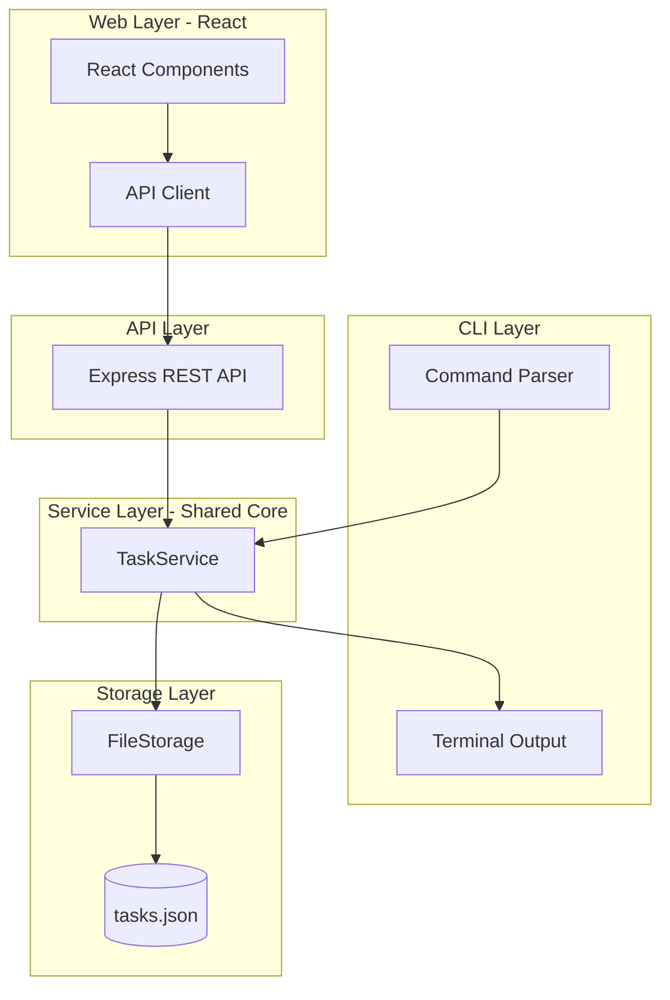
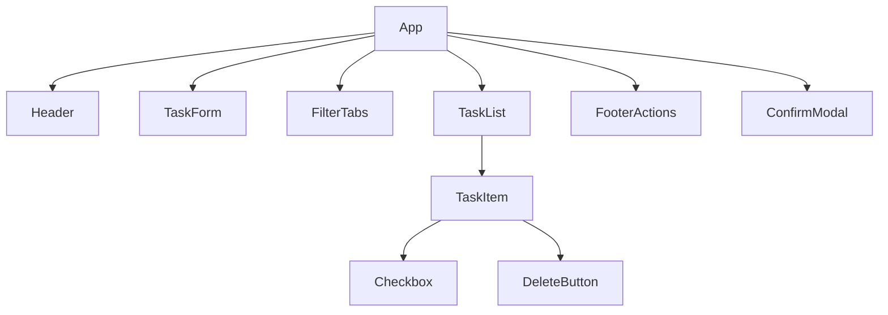
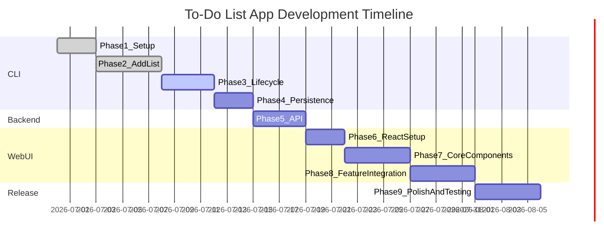

# To-Do List App — Architecture

## 1. Overview and Goals

The To-Do List App helps users manage tasks efficiently through **two interfaces**:

1. **CLI** — fast, terminal-based workflow for power users
2. **Web UI (React)** — visual, interactive interface for everyday use

Both interfaces share the same business logic and persistent storage so tasks stay in sync regardless of how they were created.

### Purpose

- Provide a fast, distraction-free way to capture and track tasks
- Offer an intuitive visual UI for users who prefer a browser
- Persist tasks locally so data survives between sessions
- Keep the codebase modular, testable, and easy to extend

### Scope (v1)

- Single-user, offline-first application
- CLI for terminal-based task management
- React web UI served via Vite
- Lightweight local API so CLI and web share the same task store
- Local file-based storage on the user's machine

### Non-Goals (v1)

- Cloud sync or remote backup
- Multi-user authentication or accounts
- Mobile native apps
- Real-time collaboration

---

## 2. Feature Requirements

### Shared Features (CLI + Web)

| Feature | CLI Command | Web UI | Behavior |
|---------|-------------|--------|----------|
| Add new task | `todo add "<title>"` | Add Task form | Creates task with unique ID, timestamps, `completed: false` |
| View tasks | `todo list` | Task list view | Shows tasks with optional All / Active / Done filters |
| Mark completed | `todo done <id>` | Checkbox toggle | Marks task as completed, updates `updatedAt` |
| Mark active again | `todo undo <id>` | Checkbox toggle | Reverts completed task to active |
| Delete task | `todo delete <id>` | Delete button | Removes a single task by ID |
| Clear all tasks | `todo clear` | Clear All button | Removes all tasks (with confirmation) |
| Local persistent storage | automatic | automatic | Every mutation writes to disk immediately |

### v1 Feature Checklist

**CLI**

- [x] Add new task
- [x] View added tasks (in-memory)
- [ ] Mark task as completed
- [ ] Delete task and clear all tasks
- [ ] Persistent storage across sessions

**Web UI**

- [ ] Add new task
- [ ] View added tasks
- [ ] Mark task as completed
- [ ] Delete task and clear all tasks
- [ ] Filter tasks (All / Active / Done)
- [ ] Persistent storage across sessions

---

## 3. High-Level Architecture

The app uses a **layered, shared-core architecture**. Business logic lives in one place; CLI and React are thin presentation layers.



### Layer Responsibilities

| Layer | Location | Responsibility |
|-------|----------|----------------|
| **CLI Layer** | `src/cli/` | Parse args, format terminal output, handle prompts |
| **Web Layer** | `web/src/` | React UI, user interactions, client-side state |
| **API Layer** | `server/` | REST endpoints wrapping `TaskService` for the web UI |
| **Service Layer** | `src/services/` | Business rules: validation, ID generation, CRUD |
| **Storage Layer** | `src/storage/` | Read/write JSON file, handle corrupt file recovery |

### Data Flow: Adding a Task (Web)

1. User types a title and clicks **Add Task** (or presses Enter)
2. React calls `POST /api/tasks` via the API client
3. Express route delegates to `TaskService.add()`
4. `TaskService` validates the title, creates a `Task`, and persists via `FileStorage`
5. API returns the new task; React updates the list optimistically or from response

### Data Flow: Adding a Task (CLI)

1. User runs `todo add "Buy groceries"`
2. CLI parses the command and calls `TaskService.add()` directly
3. `FileStorage.saveTasks()` writes to `data/tasks.json`
4. CLI prints a success message with the new task ID

---

## 4. UI/UX Design (React Web App)

### 4.1 Design Principles

| Principle | Application |
|-----------|-------------|
| **Clarity** | One primary action per screen area; no clutter |
| **Speed** | Add a task in one keystroke (Enter to submit) |
| **Feedback** | Immediate visual response for every action |
| **Forgiveness** | Confirm destructive actions (delete all, clear completed) |
| **Accessibility** | Keyboard navigable, semantic HTML, sufficient contrast |

### 4.2 User Personas

| Persona | Goal | Primary interface |
|---------|------|-------------------|
| **Alex — Busy professional** | Capture tasks quickly between meetings | Web UI on desktop |
| **Sam — Developer** | Manage tasks without leaving the terminal | CLI |
| **Jordan — Student** | Track assignments on phone browser | Web UI (responsive) |

### 4.3 Layout Wireframe

Single-column, centered layout. Max content width **640px**. Mobile-first.

```
┌─────────────────────────────────────────────┐
│  ✓ To-Do List                    3 active   │  ← Header
├─────────────────────────────────────────────┤
│  ┌─────────────────────────────┐  ┌─────┐  │
│  │ What needs to be done?       │  │ Add │  │  ← Task input
│  └─────────────────────────────┘  └─────┘  │
├─────────────────────────────────────────────┤
│  [ All (5) ]  [ Active (3) ]  [ Done (2) ]  │  ← Filter tabs
├─────────────────────────────────────────────┤
│  ☐  Buy groceries                      🗑   │
│  ☐  Walk the dog                       🗑   │  ← Task list
│  ☑  Read a book  (strikethrough)       🗑   │
├─────────────────────────────────────────────┤
│  Clear completed          Clear all tasks   │  ← Footer actions
└─────────────────────────────────────────────┘
```

### 4.4 Component Hierarchy



| Component | Responsibility |
|-----------|----------------|
| `App` | Root layout, fetches tasks, holds filter state |
| `Header` | App title and active task count badge |
| `TaskForm` | Text input + Add button; validates on submit |
| `FilterTabs` | All / Active / Done tabs with counts |
| `TaskList` | Renders filtered tasks or empty state |
| `TaskItem` | Single row: checkbox, title, delete button |
| `FooterActions` | Clear completed and Clear all buttons |
| `ConfirmModal` | Reusable dialog for destructive confirmations |
| `EmptyState` | Shown when no tasks match the current filter |

### 4.5 Visual Design System

| Token | Value | Usage |
|-------|-------|-------|
| **Primary color** | `#4F46E5` (indigo-600) | Add button, active tab, focus rings |
| **Success color** | `#16A34A` (green-600) | Completed checkbox, success messages |
| **Danger color** | `#DC2626` (red-600) | Delete actions, error states |
| **Neutral background** | `#F9FAFB` (gray-50) | Page background |
| **Surface** | `#FFFFFF` | Cards, input fields |
| **Text primary** | `#111827` (gray-900) | Headings, task titles |
| **Text secondary** | `#6B7280` (gray-500) | Meta text, placeholders |
| **Border** | `#E5E7EB` (gray-200) | Dividers, input borders |
| **Font** | `Inter, system-ui, sans-serif` | All text |
| **Border radius** | `8px` | Buttons, inputs, cards |
| **Spacing unit** | `4px` base (4, 8, 12, 16, 24, 32) | Consistent padding/margins |

### 4.6 Interaction States

| Element | Default | Hover | Active / Focus | Disabled |
|---------|---------|-------|----------------|----------|
| Add button | Indigo fill | Darker indigo | Ring outline | Gray, no pointer |
| Task checkbox | Empty square | Light gray bg | Green check fill | — |
| Delete button | Gray icon | Red icon + bg | — | Hidden on empty |
| Filter tab | Gray text | Darker text | Indigo underline + bold | — |
| Task row | White bg | Light gray bg | — | Strikethrough if done |

### 4.7 User Flows

**Flow 1 — Add a task**

1. User lands on app → sees empty state or existing list
2. User types in input field → Add button enables when text is non-empty
3. User presses Enter or clicks Add → task appears at top of list
4. Input clears → focus returns to input for rapid entry

**Flow 2 — Complete a task**

1. User clicks checkbox on a task row
2. Title gets strikethrough + muted color with brief transition
3. Task moves out of Active filter; count badges update

**Flow 3 — Delete a task**

1. User clicks delete icon on a row
2. Row fades out and is removed from list
3. Count badges update

**Flow 4 — Clear all tasks**

1. User clicks "Clear all tasks" in footer
2. Confirm modal appears: "Delete all tasks? This cannot be undone."
3. User confirms → list empties, empty state shown

### 4.8 Empty and Error States

| State | Message | CTA |
|-------|---------|-----|
| No tasks at all | "No tasks yet. Add one above to get started." | Focus input |
| No active tasks | "All caught up! No active tasks." | Switch to Done tab |
| No completed tasks | "No completed tasks yet." | — |
| API unreachable | "Could not connect to server. Is it running?" | Retry button |
| Validation error | "Task title cannot be empty." | Inline below input |

### 4.9 Responsive Behavior

| Breakpoint | Layout |
|------------|--------|
| `< 480px` | Full-width, stacked footer buttons, 16px page padding |
| `480px – 768px` | Centered column, max-width 640px |
| `> 768px` | Same as above with increased whitespace |

### 4.10 Accessibility Checklist

- All interactive elements reachable via Tab key
- Checkboxes use native `<input type="checkbox">` with labels
- Delete buttons have `aria-label="Delete task: {title}"`
- Confirm modal traps focus and closes on Escape
- Color contrast ratio ≥ 4.5:1 for all text
- Page title and heading hierarchy (`h1` → `h2`) are semantic

---

## 5. Proposed Folder Structure

```
to-do-list-cli/
├── ARCHITECTURE.md
├── README.md
├── package.json
├── bin/
│   └── todo.js                    # CLI entry point
├── server/
│   └── index.js                   # Express REST API
├── src/                           # Shared core (CLI + API)
│   ├── cli/
│   │   ├── index.js
│   │   └── formatters.js
│   ├── services/
│   │   └── taskService.js
│   ├── storage/
│   │   └── fileStorage.js
│   ├── models/
│   │   └── task.js
│   └── utils/
│       └── id.js
├── web/                           # React frontend (Vite)
│   ├── index.html
│   ├── vite.config.js
│   └── src/
│       ├── main.jsx
│       ├── App.jsx
│       ├── App.css
│       ├── components/
│       │   ├── Header.jsx
│       │   ├── TaskForm.jsx
│       │   ├── FilterTabs.jsx
│       │   ├── TaskList.jsx
│       │   ├── TaskItem.jsx
│       │   ├── FooterActions.jsx
│       │   ├── ConfirmModal.jsx
│       │   └── EmptyState.jsx
│       ├── hooks/
│       │   └── useTasks.js        # fetch, mutate, filter state
│       ├── services/
│       │   └── api.js             # REST client
│       └── styles/
│           └── variables.css      # design tokens
├── data/
│   └── tasks.json                 # shared store (gitignored)
└── tests/
    ├── taskService.test.js
    └── fileStorage.test.js
```

---

## 6. Data Model

Tasks are stored as a JSON array inside a wrapper object.

```json
{
  "tasks": [
    {
      "id": "a1b2c3",
      "title": "Buy groceries",
      "completed": false,
      "createdAt": "2026-06-29T10:00:00.000Z",
      "updatedAt": "2026-06-29T10:00:00.000Z"
    }
  ]
}
```

### Field Rules

| Field | Type | Rules |
|-------|------|-------|
| `id` | string | Short unique identifier (Node `crypto`) |
| `title` | string | Required, trimmed, maximum 200 characters |
| `completed` | boolean | Default `false` |
| `createdAt` | string | ISO 8601 timestamp, set once on creation |
| `updatedAt` | string | ISO 8601 timestamp, updated on every mutation |

---

## 7. Persistence Strategy

### Storage Location

- **Default:** `data/tasks.json` in the project root
- **Override:** set `TODO_DATA_PATH` environment variable

### Write Policy

- Synchronous write after every mutation
- Both CLI and API use the same `FileStorage` module

### Git Configuration

```
data/tasks.json
data/tasks.json.bak
```

---

## 8. Technology Stack

| Concern | Choice | Rationale |
|---------|--------|-----------|
| **Runtime** | Node.js 20+ | Native ESM, fs APIs, cross-platform |
| **CLI framework** | Commander | Standard, minimal boilerplate |
| **API server** | Express | Lightweight REST layer for React |
| **Frontend framework** | React 19 | Component-based UI, large ecosystem |
| **Build tool** | Vite | Fast HMR, first-class React support |
| **Styling** | CSS Modules or plain CSS | Design tokens in `variables.css`, no heavy UI lib for v1 |
| **IDs** | Node `crypto` | Short, collision-resistant identifiers |
| **Terminal styling** | Chalk | Readable CLI output |
| **Testing** | Node built-in test runner | Unit tests for core; manual/E2E for UI in v1 |
| **Language** | JavaScript (ESM) | Consistent across CLI, API, and web |

---

## 9. API Reference (Web Backend)

| Method | Endpoint | Body | Response |
|--------|----------|------|----------|
| `GET` | `/api/tasks` | — | `{ tasks: Task[] }` |
| `POST` | `/api/tasks` | `{ title: string }` | `{ task: Task }` |
| `PATCH` | `/api/tasks/:id` | `{ completed: boolean }` | `{ task: Task }` |
| `DELETE` | `/api/tasks/:id` | — | `{ success: true }` |
| `DELETE` | `/api/tasks` | — | `{ success: true }` (clear all) |

Query param for filtering: `GET /api/tasks?filter=active|done|all`

---

## 10. CLI Command Reference

```
todo add <title>                    Add a new task
todo list [--all|--active|--done]   List tasks (default: active only)
todo done <id>                      Mark task as completed
todo undo <id>                      Mark task as active again
todo delete <id>                    Delete a task by ID
todo clear [--force]                Delete all tasks
todo help                           Show usage information
```

---

## 11. Error Handling Conventions

### CLI

All errors print to `stderr` and exit with code `1`.

| Scenario | Message Example |
|----------|-----------------|
| Missing or invalid arguments | `Error: Task title is required.` |
| Task ID not found | `Error: Task not found: xyz123` |
| Empty title | `Error: Task title cannot be empty.` |
| Storage write failure | `Error: Failed to save tasks.` |

### Web UI

| Scenario | UX Response |
|----------|-------------|
| Empty title on submit | Inline error below input |
| API 404 | Toast: "Task not found" |
| API 500 / network error | Banner: "Something went wrong. Try again." |
| Destructive action | Confirm modal before proceeding |

---

## 12. Development Phases and Timeline

**Total estimated timeline:** 6–8 weeks (part-time, ~10–15 hours per week).

Phases 1–2 (CLI core) are **complete**. Remaining work spans CLI completion, shared persistence, API, and React UI.



---

### Phase 1 — CLI Project Setup (Days 1–3) ✅ Complete

**Goal:** Runnable CLI skeleton.

**Delivered:** `bin/todo.js`, Commander setup, folder structure, `.gitignore`.

---

### Phase 2 — Core CRUD: Add and List (Days 4–8) ✅ Complete

**Goal:** Users can add and view tasks in memory via CLI.

**Delivered:** `Task` model, `TaskService`, `todo add`, `todo list`, formatters.

---

### Phase 3 — CLI Lifecycle Commands (Days 9–12)

**Goal:** Full task lifecycle via CLI.

**Tasks:**

- Implement `TaskService.complete()`, `uncomplete()`, `delete()`, `clear()`
- Wire `todo done`, `todo undo`, `todo delete`, `todo clear` commands
- Add list filters: `--active`, `--done`, `--all`
- Add interactive confirmation for `todo clear`

**Files to modify:**

- `src/services/taskService.js`
- `src/cli/index.js`

**Exit criteria:** All CLI CRUD commands work in a single session.

---

### Phase 4 — Persistent Storage (Days 13–15)

**Goal:** Tasks survive app restarts (CLI and future API).

**Tasks:**

- Implement `FileStorage` (`loadTasks`, `saveTasks`) in `src/storage/fileStorage.js`
- Auto-create `data/tasks.json` on first run
- Hook `TaskService` to load on init and save after every mutation
- Handle corrupt/missing file edge cases
- Support `TODO_DATA_PATH` env override

**Exit criteria:** CLI add → exit → reopen → tasks still present.

---

### Phase 5 — REST API Layer (Days 16–19)

**Goal:** Expose `TaskService` over HTTP for the React app.

**Tasks:**

- Scaffold `server/index.js` with Express
- Implement all `/api/tasks` endpoints (see [API Reference](#9-api-reference-web-backend))
- Add CORS for Vite dev server (`localhost:5173`)
- Add npm scripts: `dev:server`, `dev:web`, `dev` (runs both concurrently)
- Share `TaskService` + `FileStorage` with CLI (same `data/tasks.json`)

**Files to create:**

- `server/index.js`

**Exit criteria:** CRUD works via `curl`/Postman; CLI and API read/write the same file.

---

### Phase 6 — React Project Setup (Days 20–22)

**Goal:** Vite + React app scaffolded with design system in place.

**Tasks:**

- Initialize `web/` with Vite + React (`npm create vite@latest`)
- Add design tokens in `web/src/styles/variables.css`
- Set up base layout in `App.jsx` (header, main, footer regions)
- Configure Vite proxy: `/api` → `http://localhost:3001`
- Verify HMR and API proxy work

**Files to create:**

- `web/index.html`, `web/vite.config.js`
- `web/src/main.jsx`, `web/src/App.jsx`, `web/src/App.css`
- `web/src/styles/variables.css`

**Exit criteria:** `npm run dev:web` shows styled empty shell; API proxy responds.

---

### Phase 7 — Core UI Components (Days 23–27)

**Goal:** Build all React components per the UI/UX spec (static data first).

**Tasks:**

- Build `Header`, `TaskForm`, `FilterTabs`, `TaskList`, `TaskItem`
- Build `EmptyState`, `FooterActions`, `ConfirmModal`
- Implement all interaction states (hover, focus, disabled, completed)
- Use mock/static task data to validate layout and responsiveness
- Verify accessibility checklist (keyboard nav, aria labels)

**Files to create:**

- All components under `web/src/components/`

**Exit criteria:** UI matches wireframe; works with mock data at all breakpoints.

---

### Phase 8 — Web Feature Integration (Days 28–32)

**Goal:** Connect React UI to the live API; full feature parity with CLI.

**Tasks:**

- Implement `web/src/services/api.js` REST client
- Implement `useTasks` hook (fetch, add, toggle, delete, clear, filter)
- Wire all components to live data
- Handle loading, empty, and error states
- Implement confirm modal for "Clear all" and "Clear completed"

**Files to create:**

- `web/src/services/api.js`
- `web/src/hooks/useTasks.js`

**Exit criteria:** All v1 web checklist items work end-to-end against the API.

---

### Phase 9 — Polish, Testing, and Documentation (Days 33–37)

**Goal:** Production-ready v1 release.

**Tasks:**

- Unit tests for `TaskService`, `FileStorage`, and API routes
- Update `README.md` with CLI commands, web setup, and architecture link
- Final UI polish: transitions, focus management, empty states
- Cross-check CLI + web sync (add via CLI, see in web and vice versa)
- Optional: global CLI install via `npm link`

**Exit criteria:** Tests pass; README complete; full v1 checklist green on both interfaces.

---

## 13. Phase Summary

| Phase | Duration | Status | Deliverable |
|-------|----------|--------|-------------|
| 1 — CLI Setup | Days 1–3 | ✅ Done | Runnable CLI skeleton |
| 2 — Add and List | Days 4–8 | ✅ Done | In-memory add and list |
| 3 — CLI Lifecycle | Days 9–12 | In progress | done, delete, clear commands |
| 4 — Persistence | Days 13–15 | Pending | Shared JSON file storage |
| 5 — REST API | Days 16–19 | Pending | Express API for web |
| 6 — React Setup | Days 20–22 | Pending | Vite + React + design tokens |
| 7 — UI Components | Days 23–27 | Pending | Full component library |
| 8 — Web Integration | Days 28–32 | Pending | Live API-connected UI |
| 9 — Polish and Release | Days 33–37 | Pending | Tests, docs, v1 release |

---

## 14. Future Enhancements

- Edit task title (`todo edit` / inline edit in UI)
- Due dates and priorities with sort/filter
- Categories and tags
- Dark mode toggle
- Export/import (JSON, CSV)
- Drag-and-drop task reordering
- Desktop notifications for due tasks

---

## 15. Getting Started (for developers)

```bash
# Install dependencies
npm install

# Run CLI
npm run todo -- help
npm run todo -- add "Buy groceries"
npm run todo -- list

# Run API server (after Phase 5)
npm run dev:server

# Run React web app (after Phase 6)
npm run dev:web

# Run both together (after Phase 5)
npm run dev
```

Refer to the phase sections above for what to build next.
